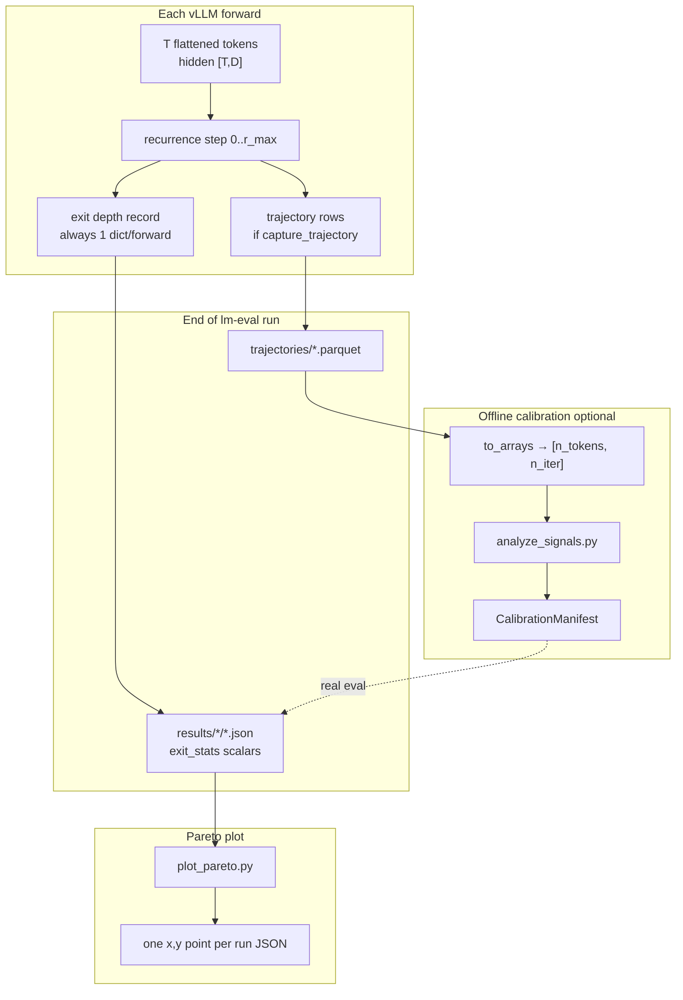
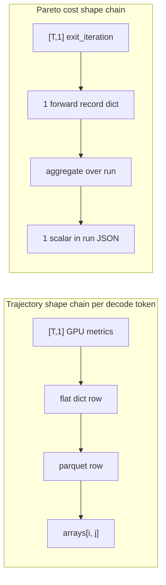

# Recurrent-depth lm-eval (fixed vs adaptive Raven)

Paper-oriented evaluation of **fixed recurrence** vs **adaptive early exit** via
[lm-evaluation-harness](https://github.com/EleutherAI/lm-evaluation-harness).

**Default / production path:** `--backend vllm` → `AdaptiveRavenForvLLM` under
vLLM-Hook. Optional `--backend hf` → `AdaptiveRavenForCausalLM` (numerical oracle).

## Install

```bash
conda activate vllm_hook_env_py312   # or your env with vllm
pip install "lm_eval[hf]" datasets matplotlib
# Raven HF pin used elsewhere: transformers==4.51.0
```

## Data lifecycle (two parallel streams)

Each vLLM forward produces **two independent telemetry paths**. They share the
same GPU recurrence loop but serve different downstream consumers.



### Stream A — trajectory (calibration only)

| Stage | Shape / format | Notes |
| ----- | -------------- | ----- |
| GPU worker | one Python dict per `(decode token, iteration)` | gated by `--capture-trajectory` |
| Harness | `list[dict]` harvested at end of run | decode rows only; prefill filtered out |
| Parquet | long table, one row per `(forward, iteration, token)` | `trajectory_io.write_trajectory_parquet` |
| `to_arrays` | `{metric: ndarray [n_tokens, n_iter]}` | input to `analyze_signals.py` |

Use with `--rho 0` so every decode token runs full depth (oracle labels for
threshold selection). Calibrate on a subset (`--limit 64–256`); full GSM8K eval
does not need trajectory.

### Stream B — exit depth / cost stats (Pareto x-axis)

| Stage | Shape / format | Notes |
| ----- | -------------- | ----- |
| GPU worker | one compute-record dict per forward | from `exit_iteration [T,1]` + decode mask |
| Harness | `list[dict]` → aggregated scalars | `_exit_stats_from_samples` in `raven_lm_eval_vllm.py` |
| Run JSON | `exit_stats.mean_effective_r_decode` + accuracy | one file per sweep config |

**Always on** — no `--capture-trajectory` flag needed for fixed/adaptive Pareto
sweeps or final policy eval.



**How the streams relate:** Stream A picks thresholds offline (counterfactual
replay in `analyze_signals.py`). Stream B measures **real** cost and accuracy
when a policy (or fixed depth / ρ) actually runs. The manifest from A is fed
into a new eval run; B produces the honest Pareto point.

## Pareto axes

- **X (primary):** `exit_stats.mean_effective_r_decode` — token-weighted mean
  recurrence over **decode** rows only. Exit is decode-only, so prefill rows are
  pinned at the cap and would otherwise hide the savings.
- **X (secondary):** `mean_effective_r_token` (all rows, token-weighted) and
  `mean_effective_r` (legacy per-forward mean, kept for old result files).
- **Y:** lm-eval task metric (e.g. GSM8K `exact_match`).

`exit_stats` also reports `attn_token_steps` (attention runs on every row) and
`mlp_token_steps` (MLP runs on active rows only) for FLOP-style cost plots.


| Arm      | How                                                            |
| -------- | -------------------------------------------------------------- |
| Fixed    | `--sweep-fixed 4,8,16,32` → `rho=0`, vary `num_steps`          |
| Adaptive | `--sweep-rho 0,0.01,… --num-steps 32` → vary `ρ`, cap `r_max`  |
| Policy   | `--condition READOUT=THR …` or `--policy-manifest <json>`      |


Fixed and ρ sweeps can run in **one** invocation.

## Quick start (vLLM)

```bash
# Smoke
python benchmarks/recurrent_depth/run_lm_eval.py --backend vllm \
  --tasks gsm8k --num-fewshot 5 --limit 32 --rho 0 --num-steps 32

# Publication sweep + plot
bash benchmarks/recurrent_depth/run_sweep.sh
# or with a limit first:
LIMIT=100 bash benchmarks/recurrent_depth/run_sweep.sh
```

HF reference curve:

```bash
BACKEND=hf OUT=benchmarks/recurrent_depth/results/hf \
  bash benchmarks/recurrent_depth/run_sweep.sh
```


## Files


| File                       | Role                            |
| -------------------------- | ------------------------------- |
| `raven_lm_eval.py`         | HF `adaptive_raven`             |
| `raven_lm_eval_vllm.py`    | vLLM `adaptive_raven_vllm`      |
| `run_lm_eval.py`           | sweeps (`--backend hf\|vllm`)   |
| `trajectory_io.py`         | flat trajectory → parquet       |
| `analyze_signals.py`       | offline threshold calibration   |
| `plot_pareto.py`           | quality vs \bar{r} PDF/PNG      |
| `run_publication_sweep.sh` | fixed + ρ grids + plot          |

With `--capture-trajectory`, per-token decode metrics are written to
`results/<backend>/trajectories/<slug>.parquet`. Run JSON / `sweep_summary.json`
only keep a short summary (`n_rows`, path, exit stats, accuracy).

```python
import pandas as pd
df = pd.read_parquet(".../trajectories/vllm_fixed_rho0.0_r32.parquet")
# columns: forward_index, iteration, token_index, is_decode,
# normalized_displacement, entropy, predictive_kl, ...
```

## Calibration loop

Calibrate on a subset (`--limit 64–256`); do not use `--capture-trajectory` on
full GSM8K eval. Final Pareto / policy runs need only `exit_stats`, not trajectory.

```bash
# 1. collect a full-depth trajectory on a calibration subset
python benchmarks/recurrent_depth/run_lm_eval.py --backend vllm \
  --tasks gsm8k --num-fewshot 5 --num-steps 32 --rho 0 --limit 64 \
  --capture-trajectory --prediction-metrics

# 2. label earliest safe depth and sweep thresholds / conjunctions
python benchmarks/recurrent_depth/analyze_signals.py \
  --trajectory benchmarks/recurrent_depth/results/vllm/trajectories/vllm_fixed_rho0.0_r32.parquet \
  --min-steps 2 --patience 2 --max-false-exit 0.02 --pairs \
  --out-json benchmarks/recurrent_depth/results/vllm/signal_report.json \
  --write-manifest benchmarks/recurrent_depth/calibration/huginn_gsm8k_r32.json

# 3. evaluate the frozen policy on held-out / full GSM8K (no capture-trajectory)
python benchmarks/recurrent_depth/run_lm_eval.py --backend vllm \
  --tasks gsm8k --num-fewshot 5 --num-steps 32 \
  --policy-manifest benchmarks/recurrent_depth/calibration/huginn_gsm8k_r32.json
```

Earliest safe depth = shallowest depth whose top-1 token already matches the
full-depth token for all remaining iterations (optionally tightened with
`--stability-kl` / `--stability-margin-frac`). Threshold grids come from data
quantiles, so no constants are hardcoded. Replay assumes exiting at depth `d`
yields the depth-`d` latent, so confirm the selected policy with a real run.
