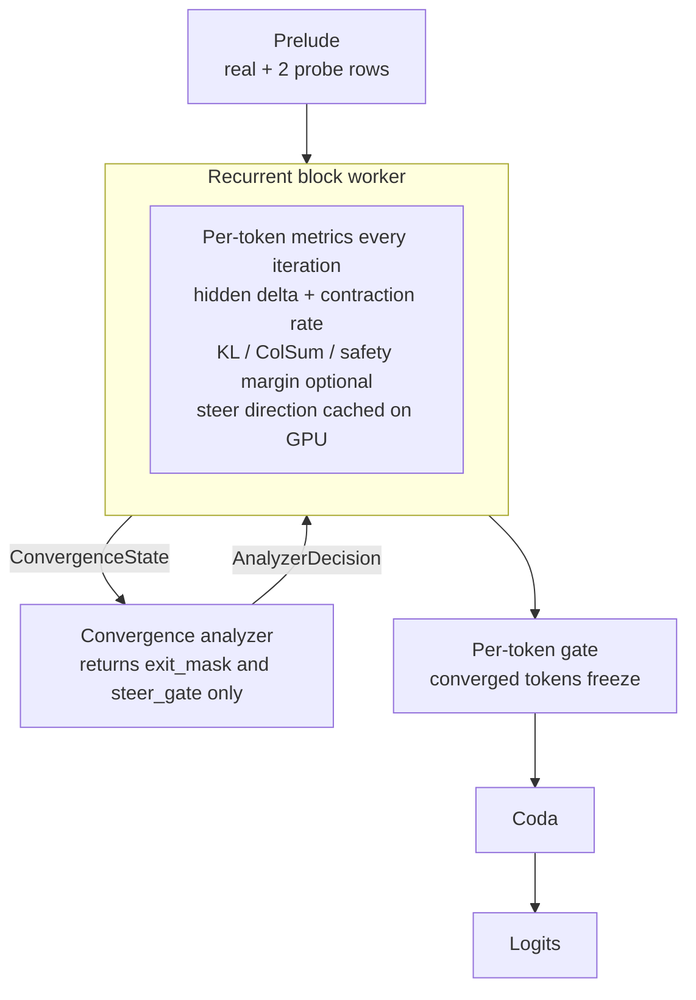
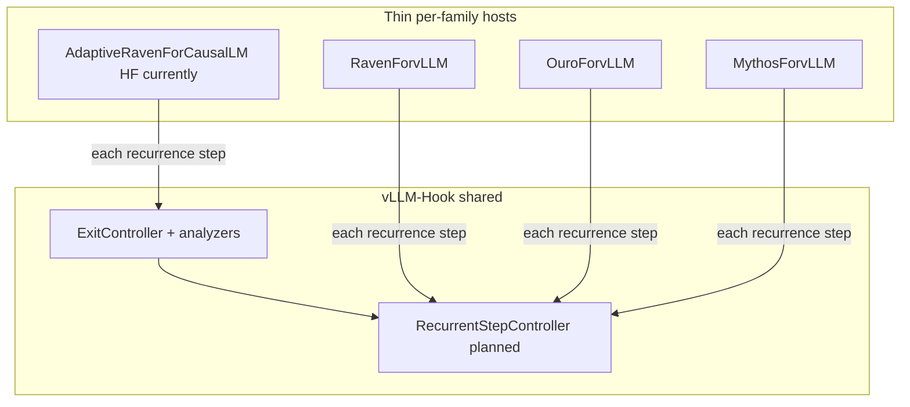
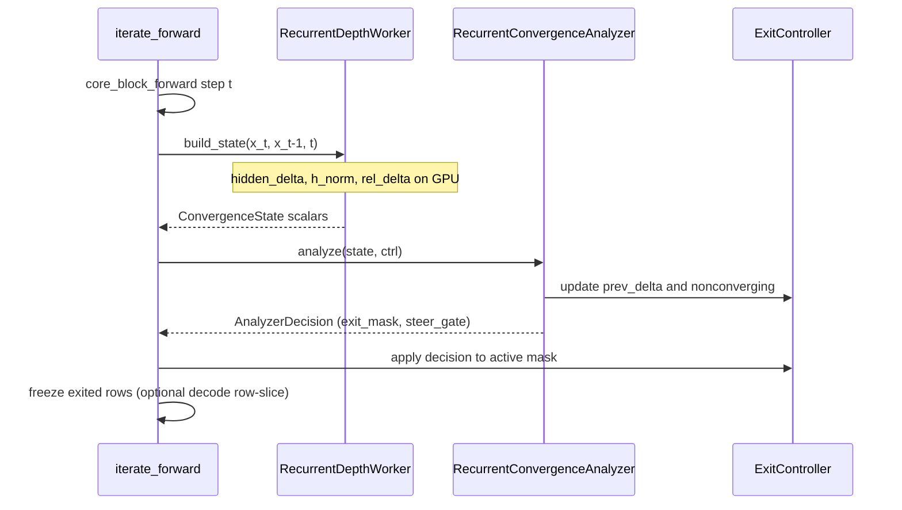
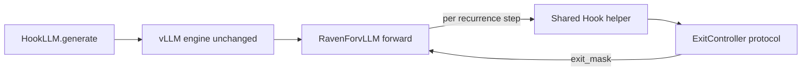

# Recurrent Depth — Adaptive Early Exit (Stage 1)

*vLLM-Hook use case · draft for PR review*

**Demo.** `[examples/demo_recurrent_depth.py](../../examples/demo_recurrent_depth.py)`

Recurrent-depth LMs (Huginn family / Raven, retrofitted Llama/OLMo, Ouro / OpenMythos, etc.) iterate a shared transformer block (often comprised of a stack of decoder layers) many times per token. Different tokens need different depth, but serving stacks typically run a fixed recurrence. **Stage 1** adds a training-free, per-token adaptive exit protocol inside vLLM-Hook. **Stage 2** (safety steering mid-recurrence) is scaffolded but not yet finalized.

This document outlines current implementation (HuggingFace Raven path + adaptive exit protocol draft), worker and analyzer communication in-process, and the planned thin out-of-tree vLLM model executor so the same protocol can run under `HookLLM` without forking the vLLM engine.

---


## Goal and scope


| Stage        | Capability                                                                            | Status                                                                             |
| ------------ | ------------------------------------------------------------------------------------- | ---------------------------------------------------------------------------------- |
| **1**        | Per-token adaptive exit via contraction-rate criterion; A/B vs Huginn native criteria | **Implemented** on HF in-process with `AdaptiveRavenForCausalLM`                   |
| **1 → vLLM** | Same protocol under `HookLLM` via OOT `RavenForvLLM`                                  | **In-progress** (no vLLM core fork)                                                |
| **2**        | Contrastive safety margin + mid-recurrence steering                                   | To finalize following Stage 1 completion (currently scaffold only within protocol) |


**Adapters in scope (design):**


| Family           | Checkpoints                                   | Native exit                        | Role                                                                                |
| ---------------- | --------------------------------------------- | ---------------------------------- | ----------------------------------------------------------------------------------- |
| Raven            | Huginn-0125, retrofitted Llama/OLMo/TinyLlama | `generate_with_adaptive_compute`   | Proof-of-concept/important baseline (Stage 1 done on HF)                            |
| Ouro             | Ouro 1.4B / 2.6B                              | trained gate (disabled under vLLM) | Comparison (our training-free contraction rate exit criterion vs. Ouro's mechanism) |
| MoR / OpenMythos | optional                                      | router / ACT                       | Broader paradigm generalization (MoR)                                               |


---


## Architecture overview (Stage 1)




*Figure 1. Prelude → recurrent block (worker metrics on GPU) ↔ convergence analyzer (*`exit_mask` */* `steer_gate`*) → per-token freeze gate → coda → logits. Heavy tensors stay on the worker; the analyzer returns only* `[B]` */* `[B, S]` *control signals.*

### Raven call chain (HF)

Upstream Raven keeps the loop in `iterate_forward` only. The adapter overrides **that method and nothing else**:

```
forward()                        # no loop
  ├── prelude blocks
  ├── iterate_forward()          # ← AdaptiveRavenForCausalLM override
  │     └── core_block_forward() # noise → adapter(cat[x, e]) → core layers
  ├── coda blocks
  └── ln_f → lm_head
```

`block_idx` is a running cache index (prelude `0..n-1`, then increments across recurrence; coda negative). It must advance the same way whether or not positions are frozen.

### Share vs family-specific




*Figure 2. Adaptive exit/steering decisions live once in Hook. Each model family still needs a thin host for its forward graph, weight load, and Attention/KV layout.*


| Component                                    | Shared in Hook?      | Location/Handler                       |
| -------------------------------------------- | -------------------- | -------------------------------------- |
| Exit / steer protocol, contraction analyzer  | Yes                  | `protocols/`, `workers/`, `analyzers/` |
| Hidden-state freeze from `exit_mask`         | Yes (tensor ops)     | protocol / planned step helper         |
| Attention / KV slot indexing, congruent fill | **No**               | Family adapter / executor              |
| Prelude–core–coda vs UT-over-all-layers      | No                   | Family host                            |
| Scheduler / paged-KV reclaim / CUDA graphs   | Out of scope Stage 1 | Upstream vLLM (defer)                  |


---


## Current implementation (in-progress)


### Layout

`model_adapters/` is split by runtime: **`hf/`** (HuggingFace adapters + upstream HF Raven) and **`vllm/`** (out-of-tree vLLM executors). `from model_adapters import ...` still re-exports the public names.


| Path                                                                                                                                           | Role                                                     |
| ---------------------------------------------------------------------------------------------------------------------------------------------- | -------------------------------------------------------- |
| `[vllm_hook_plugins/.../workers/recurrent_depth_worker.py](../../vllm_hook_plugins/vllm_hook_plugins/workers/recurrent_depth_worker.py)`       | GPU metrics → `ConvergenceState`                         |
| `[vllm_hook_plugins/.../analyzers/recurrent_conv_analyzer.py](../../vllm_hook_plugins/vllm_hook_plugins/analyzers/recurrent_conv_analyzer.py)` | Contraction-rate → `AnalyzerDecision`                    |
| `[vllm_hook_plugins/.../protocols/exit_controller.py](../../vllm_hook_plugins/vllm_hook_plugins/protocols/exit_controller.py)`                 | `ConvergenceState`, `AnalyzerDecision`, `ExitController` |
| `[vllm_hook_plugins/.../protocols/recurrent_config.py](../../vllm_hook_plugins/vllm_hook_plugins/protocols/recurrent_config.py)`               | Shared knobs (`rho`, `min_steps`, …)                     |
| `[vllm_hook_plugins/.../protocols/recurrent_depth.py](../../vllm_hook_plugins/vllm_hook_plugins/protocols/recurrent_depth.py)`                 | `attach_recurrent_depth` / `RecurrentDepthProtocol`      |
| `[model_adapters/hf/looped_llama_adapter.py](../../model_adapters/hf/looped_llama_adapter.py)`                                                 | HF `AdaptiveRavenForCausalLM`, `RowSliceCacheProxy`      |
| `[model_adapters/hf/raven_baseline_exit.py](../../model_adapters/hf/raven_baseline_exit.py)`                                                   | Huginn native criteria for A/B                           |
| `[model_adapters/hf/raven_modeling_minimal_llama.py](../../model_adapters/hf/raven_modeling_minimal_llama.py)`                                 | Upstream HF Raven (reference; do not edit)               |
| `[model_adapters/vllm/adaptive_raven_vllm.py](../../model_adapters/vllm/adaptive_raven_vllm.py)`                                               | Adaptive vLLM executor (`AdaptiveRavenForvLLM`)          |
| `[model_adapters/vllm/original_raven_vllm.py](../../model_adapters/vllm/original_raven_vllm.py)`                                               | Vendored fixed-depth vLLM Raven (reference; do not edit) |


**Important:** `RecurrentDepthWorker` is **not** a HookLLM `worker_extension_cls`. Exit decisions must run **in-process inside the recurrence loop**. Disk/RPC analyze is post-hoc only and cannot freeze mid-iteration. Do not pass `worker_name` / `analyzer_name` for this use case — those construct the RPC probe plane. Call `register_adaptive_raven()` (not `register_plugins()`) and pass `hf_overrides={"architectures": ["AdaptiveRavenForvLLM"], "recurrent_depth": {...}}`.

### Worker ↔ analyzer communication

Unlike Token Highlighter (capture → artifact → offline analyze) and other use cases, recurrent depth is a **tight per-iteration interaction**:




*Figure 3. In-process worker → analyzer → controller loop (no file I/O). Everything is done in-process, within the overridden model* `forward` *method.*

**Roles:**


| Component          | Owns                                                                                                                                                           | Does not own                       |
| ------------------ | -------------------------------------------------------------------------------------------------------------------------------------------------------------- | ---------------------------------- |
| **Worker**         | Absolute `‖Δx‖`, `‖x‖`, `rel_delta`; optional KL / Stage-2 contrastive loss/safety margin; steer direction cached on GPU to avoid expensive I/O with analyzer. | Exit policy                        |
| **Analyzer**       | Contraction-rate exit; marks `nonconverging` when `r̂ ≥ 1`                                                                                                     | Logits, attention maps, directions |
| **ExitController** | `active` mask, `prev_delta`, `exit_iteration`                                                                                                                  | Architecture / KV                  |
| **Adapter**        | `iterate_forward`, RoPE slice, `RowSliceCacheProxy`, Huginn baselines                                                                                          | Shared exit math                   |


**Invariant:** `ConvergenceState` holds only `[B]` or `[B, S]`. Never logits `[B,S,V]`, attention `[B,H,S,S]`, or steer directions `[B,S,D]` which stay on the worker.

### Exit criterion (default)

Training-free predictive contraction (not Huginn’s reactive `latent-diff`):

```
r̂ = ‖Δx_t‖ / ‖Δx_{t-1}‖          # consecutive steps, not vs first
remaining ≈ ‖Δx_t‖ · r̂ / (1 − r̂)
exit when remaining / ‖x_t‖ < ρ  AND  r̂ < 1
```

- `ρ = 0` → nothing exits (exact-match oracle vs unmodified Raven).
- Huginn baselines (`latent-diff`, `kl`, `entropy-diff`, `argmax-stability`) live in the **adapter**, not the shared analyzer, for A/B at per-position grain.


### Decode row slicing (Raven-specific)

At decode (`S == 1`), inactive batch rows can be sliced out of `core_block_forward` for FLOP savings. Prefill (`S > 1`) never slices since positions must stay mutually attendable.

`RowSliceCacheProxy` expands sliced K/V writes back into full-batch `HuginnDynamicCache` and fills inactive rows with **latest-congruent** KV using config geometry (`n_layers_in_recurrent_block`, `n_layers_in_prelude`).

---


## Example usage (HF Raven)

Requires a Raven / Huginn / retrofitted checkpoint and `transformers==4.51.0`.

```bash
# From repo root; install vllm_hook_plugins editable as usual
python examples/demo_recurrent_depth.py \
  --model tomg-group-umd/huginn-0125 \
  --prompt "The capital of France is" \
  --rho 0.0
# vLLM executor smoke test:
python examples/demo_recurrent_depth.py --backend vllm --rho 0.0
```

Programmatic wiring:

```python
import torch
from transformers import AutoTokenizer
from model_adapters.hf import (
    AdaptiveRavenForCausalLM,
    HuginnDynamicCache,
    RavenAdapterConfig,
)
from vllm_hook_plugins.protocols.recurrent_depth import attach_recurrent_depth

tok = AutoTokenizer.from_pretrained(model_id, trust_remote_code=True)
model = AdaptiveRavenForCausalLM.from_pretrained(
    model_id, torch_dtype=torch.bfloat16, trust_remote_code=True
).eval().cuda()

# ρ = 0: no exit — logits must match stock RavenForCausalLM
proto = attach_recurrent_depth(
    model,
    rho=0.0,
    min_steps=1,
    raven_cfg=RavenAdapterConfig(slice_decode=True),
)

# Optional A/B vs Huginn native criterion:
# raven_cfg=RavenAdapterConfig(baseline_criterion="latent-diff")

cache = HuginnDynamicCache(lookup_strategy="latest-m4")
out = model(
    input_ids=tok(prompt, return_tensors="pt")["input_ids"].cuda(),
    use_cache=True,
    past_key_values=cache,
)

print(proto.last_exit_iteration)   # [B, S]; -1 if never exited
print(proto.last_nonconverging)    # positions with r̂ ≥ 1 while active
```

---


## Example usage (`HookLLM` / vLLM)

Register **only** `AdaptiveRavenForvLLM` (do not call `register_plugins()` — that is the probe worker/analyzer set). The arch name is **not** seal-rg `RavenForCausalLM`; Huginn checkpoints still advertise that name, so override `architectures`.

```python
from vllm_hook_plugins import HookLLM
from model_adapters.vllm import ADAPTIVE_RAVEN_ARCH, register_adaptive_raven

register_adaptive_raven()
llm = HookLLM(
    model="tomg-group-umd/huginn-0125",
    trust_remote_code=True,
    enforce_eager=True,
    hf_overrides={
        "architectures": [ADAPTIVE_RAVEN_ARCH],  # "AdaptiveRavenForvLLM"
        "recurrent_depth": {
            "rho": 0.02,
            "min_steps": 2,
            # optional out-of-tree classes (Worker(model, cfg) / Analyzer(cfg)):
            # "analyzer": "my_pkg.policy:ContractionAndKL",
        },
    },
)
```

Demo: `python examples/demo_recurrent_depth.py --backend vllm --rho 0.0`. `vllm serve` uses the same `hf_overrides` after calling `register_adaptive_raven()`.

---


## In-progress: custom vLLM model executor (no vLLM engine fork)


### Rationale

Today users still run a custom HF forward / generate path for these recurrent models. The Stage 1 goal for serving is: `HookLLM(model=...)` **with the protocol inside recurrence**, without managing per-model inference loops, matching familiar UI from other vLLM-Hook use cases.

HookLLM alone cannot host Raven: it wraps `vllm.LLM` and expects a **vLLM model-executor** class registered by architecture name.
**No core / scheduler fork** for Stage 1 serving:

- Register an out-of-tree model via the existing `vllm.general_plugins` entry point (same mechanism vLLM-Hook already uses for plugins).
- Recurrence + Attention KV layout live in that class’s `forward`.
- Protocol owns *when* to exit; the executor owns Raven topology and cache slots.

Planning to defer engine PRs (scheduler mid-recurrence retire, reclaim unused recurrent KV, CUDA graphs with variable depth, continuous-batching wall-clock when depths differ). Stage 1 success is in-forward / FLOP savings and `ρ = 0` parity with the HF model, not improvements on scheduler-level continuous-batching.

### Planned stack under HookLLM




*Figure 4. OOT executor under an unchanged vLLM engine; decisions stay in Hook.*

### Planned Stage 1 additions

1. **Shared Hook helper** (e.g. `RecurrentStepController`): call protocol → `exit_mask` / `steer_gate`; optional **hidden-state** freeze. No Attention/KV APIs.
2. **Thin** `RavenForvLLM`: prelude / core / coda, weight load, and Raven Attention/KV slot scheme under vLLM (prefer distinct per-recurrence Attention identities, as Ouro did in-tree). Loop body calls the Hook helper for decisions only. Exploring adaptation of experimental [seal-rg Huginn vLLM plugin](https://github.com/seal-rg/recurrent-pretraining/tree/main/vllm) to support per-token adaptive compute/exit via vLLM-Hook.
3. `register_adaptive_raven()` → `ModelRegistry.register_model("AdaptiveRavenForvLLM", "…:AdaptiveRavenForvLLM")` via lazy string (own name, not seal-rg `RavenForCausalLM`; callers set `hf_overrides["architectures"]`).
4. **Demo:** `HookLLM(..., enforce_eager=True)` on Huginn / retrofitted Llama; keep HF `AdaptiveRavenForCausalLM` as `ρ = 0` numerical oracle.
5. Later families (Ouro, OpenMythos): more thin shims calling the same helper.

`enforce_eager=True` remains mandatory: currently, CUDA graphs do not support variable-depth inference/exit.

---


## Stage 2

`steer_gate` is already on `AnalyzerDecision` but zeros in Stage 1. Planned direction: trigger on safety-margin **drift**, inject `normalize(x_0 − x_t)` (restore trajectory), not unconditional `+∂M/∂x`. ColSum / QK capture will likely reuse Token Highlighter patterns.

---


## Important Papers/References

- Geiping et al., Huginn — arXiv:2502.05171
- McLeish et al., retrofitting recurrence — `github.com/mcleish7/retrofitting-recurrence`
- seal-rg Huginn vLLM plugin — `github.com/seal-rg/recurrent-pretraining/tree/main/vllm`
- vLLM [Registering a Model](https://docs.vllm.ai/en/latest/contributing/model/registration/) / [Plugin System](https://docs.vllm.ai/en/latest/design/plugin_system/)

