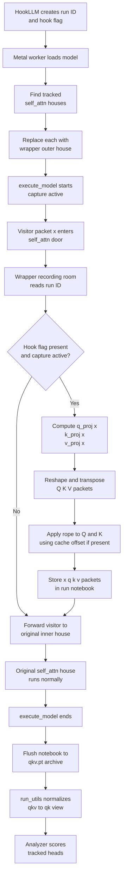
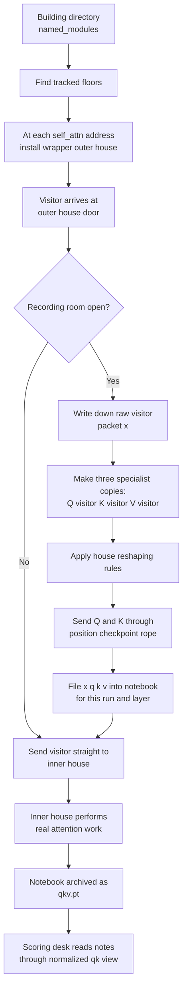

# Flow Chart For The Current Metal Worker

This flow chart matches the current `self_attn`-wrapper Metal worker and uses the same housing analogy as [housing_analogy_metal_self_attn.md](/Users/timothyburley/opensource/vLLM-Hook/sandbox/markdowns/housing_analogy_metal_self_attn.md).

## Compact View

## Housing View

## Short Reading Guide

- `wrapper outer house`
  - the installed `MLXHookWrapper` at `model.layers.<i>.self_attn`
- `inner house`
  - the original Metal Granite `Attention` module
- `visitor packet x`
  - the raw hidden-state tensor entering `self_attn`
- `notebook`
  - `self._run_cache`
- `archive`
  - `qkv.pt`
- `scoring desk`
  - the analyzer path after `run_utils` normalizes `qkv_cache` into `qk_cache`
